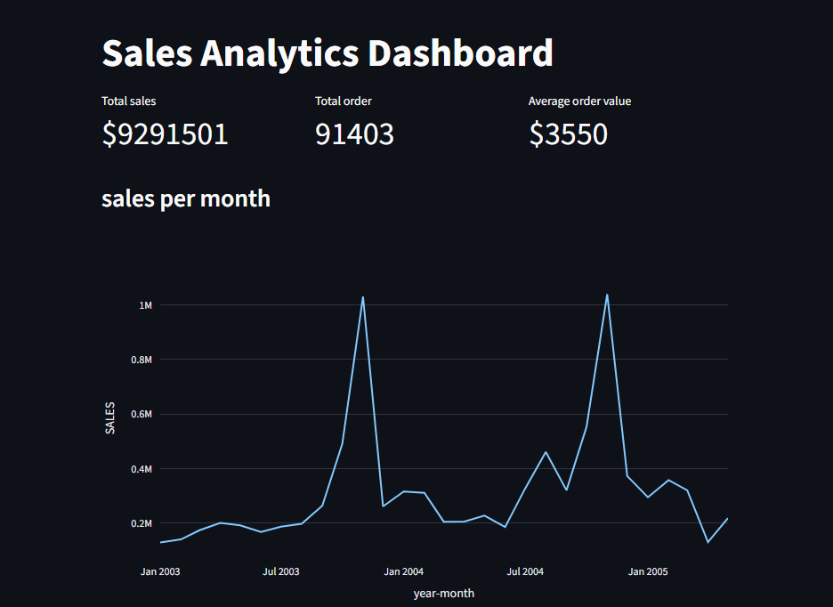
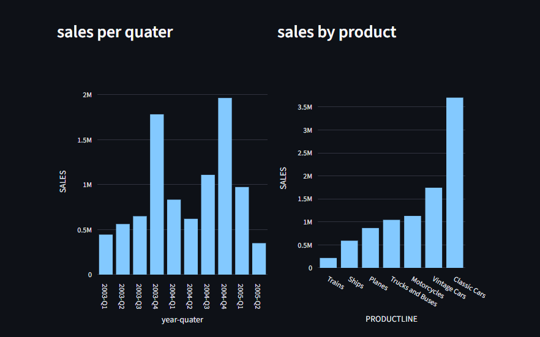

# Business Sales Data Analysis Dashboard

## Project Overview

🚀 Interactive Sales Dashboard using Streamlit & Plotly | End-to-End Data Analysis Project

The data was cleaned using Python **pandas**, visualized using **matplotlib and plotly** charts to identify key trends and insights and dashboard using **streamlit**.

The project covers the complete workflow:
- Data Cleaning (Pandas)
- Exploratory Data Analysis (Jupyter)
- Interactive Dashboard (Streamlit)
- Visualization (Matplotlib and Plotly)

## Business Questions Answered

This analysis aims to answer the following business questions:

1. Which countries generate the highest sales?
2. Which product lines are the most profitable?
3. How do sales change across months and quarters?
4. Is there any seasonal trend in sales?
5. Which year had the highest sales growth?

## Project Structure

```
SALES_ANALYSIS_DASHBOARD_PYTHON/
│
├── app.py # Main Streamlit app
│
├── data/ # Raw & processed data
│
├── notebooks/ # Data exploration (EDA)
│ └── 01_explore.ipynb
│
├── src/ # Core logic
│ ├── data_loader.py
│ ├── cleaning.py
│ └── visualization.py
│
├── requirements.txt
└── README.md
```

## Technologies Used

* Python
* Numpy
* Pandas
* Matplotlib
* Plotly
* Jupyter Notebook
* Streamlit
* VS Code

## Data Cleaning Steps

The following preprocessing steps were performed:

* Converted ORDERDATE to datetime format
* Checked for deplicate value than Removed duplicate rows
* Checked for missing values
* Aggregated sales data for visualization

The cleaned dataset was stored in:

data/processed/clean_sales_data.csv

## Visualizations Created

1. Sales by Country (Bar Chart)
2. Sales by Month (Line Chart)
3. Sales by Product Line (Bar Chart)
4. Sales by Quarter (Bar Chart)
5. Sales by Year (Bar Chart)

These charts help identify business performance trends and seasonal patterns.

## 📸 Demo

### 🔹 Dashboard Overview


### 🔹 Sales by Product Line


## Key Insights

* Certain countries contribute significantly higher sales.
* Sales show seasonal trends across months.
* Some product lines generate more revenue than others.

## How to Run the Project

1. Clone the repository
2. Install dependencies

```
pip install -r requirements.txt
```

3. Run data cleaning

```
python scripts/01_cleaning.py
```

4. Run visualization

```
python scripts/02_visualization.py
```

## Author

Data Analysis Project built using Python.
