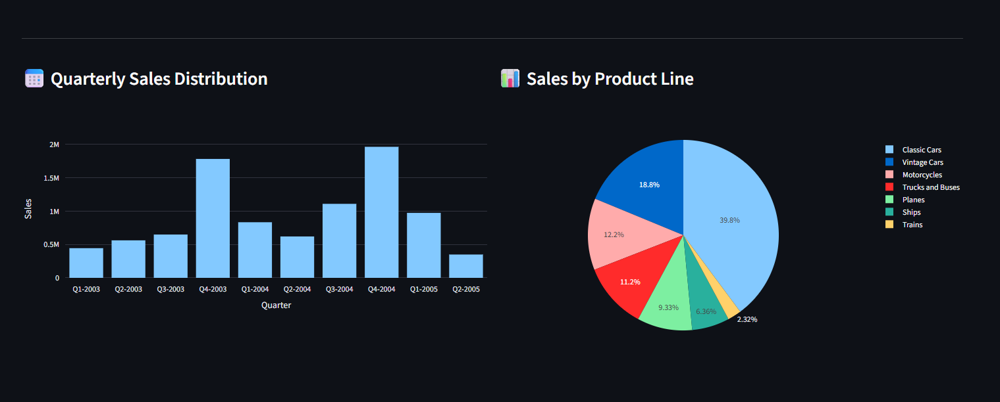
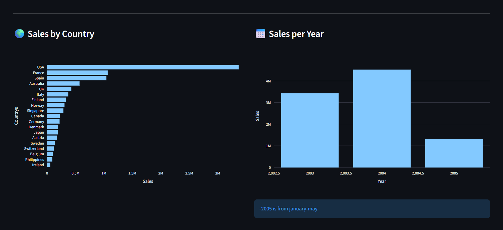

# 📊 Sales Dashboard (Streamlit)

An interactive sales dashboard built using Python, Pandas, and Streamlit to analyze and visualize business sales data.

🚀 Live Demo

👉 👉 [Click here to view the app](https://sales-analytics-dashboard-by-avaneesh.streamlit.app/)

## Project Overview

🚀 Interactive Sales Dashboard using Streamlit & Plotly | End-to-End Data Analysis Project

The data was cleaned using Python **pandas**, visualized using **matplotlib and plotly** charts to identify key trends and insights and dashboard using **streamlit**.

The project covers the complete workflow:
- Data Cleaning (Pandas)
- Exploratory Data Analysis (Jupyter)
- Interactive Dashboard (Streamlit)
- Visualization (Matplotlib and Plotly)

## Project Structure

```
SALES_ANALYSIS_DASHBOARD_PYTHON/
│
├── app.py # Main Streamlit app
│
├── data/ # Raw & processed data
│
├──assets/ # Contain img for demo
│
├── notebooks/ # Data exploration (EDA)
│ └── explore.ipynb
│
├── src/ # Core logic
│ ├── data_loader.py
│ ├── cleaning.py
│ └── visualization.py
│
├── requirements.txt
└── README.md
```

## Technologies Used

* Python
* Numpy
* Pandas
* Matplotlib
* Plotly
* Jupyter Notebook
* Streamlit
* VS Code

## Data Cleaning Steps

The following preprocessing steps were performed:

* Converted ORDERDATE to datetime format
* Checked for deplicate value than Removed duplicate rows
* Checked for missing values
* Aggregated sales data for visualization

The cleaned dataset was stored in:

data/processed/clean_sales_data.csv

## Visualizations Created

1. Sales by Country (Bar Chart)
2. Sales by Month (Line Chart)
3. Sales by Product Line (Pie Chart)
4. Sales by Quarter (Bar Chart)
5. Sales by Year (Bar Chart)

## These charts help identify business performance trends and seasonal patterns.

📊 Sample Insights

1. Sales trends across different years
2. Peak sales months
3. Revenue distribution

## 📸 Demo

### 🔹 Dashboard Overview


### 🔹 Sales by Product Line and Quarter


### 🔹 Sales by Country and Year


## 🔮 Future Improvements

* Add more filters (country, product line)
* Improve UI/UX
* Add advanced analytics
* Deploy with custom domain

## How to Run the Project

1 - Clone the repository

 - git clone https://github.com/avaneesh0/sales_analysis_dashboard_python

2 - Install dependencies
 
 - pip install -r requirements.txt

3 - Run the Streamlit app

 - streamlit run app.py

## Author

Avaneesh Singh

Data Analysis Project built using Python.
